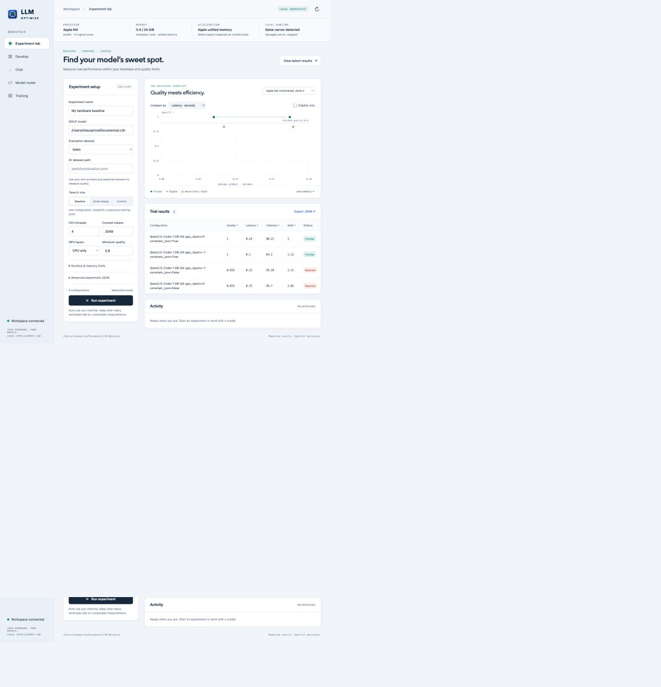

<p align="center"></p>

<p align="center"><strong>A practical laboratory for specialised LLMs on constrained hardware.</strong><br>Measure the trade-offs. Build with your models. Route with explicit limits.</p>

<p align="center">Linux · macOS · Windows &nbsp; | &nbsp; Browser / native desktop + CLI &nbsp; | &nbsp; Local · Cloud · Mixed &nbsp; | &nbsp; Docker</p>

<p align="center"><a href="docs/getting-started.md">Get started</a> · <a href="docs/user-guide.md">User guide</a> · <a href="docs/cli-reference.md">CLI reference</a> · <a href="docs/training-research.md">Research</a> · <a href="docs/validation.md">Validation evidence</a></p>

---

LLM-Optimise helps you find useful configurations when CPU, RAM, GPU memory or budget are limited. Evaluate real task quality alongside latency and memory, keep the failed trials, and use the surviving configurations to guide the next experiment.

The application combines a lightweight Python control layer, browser interface and optional Tauri desktop shell. A profiled Rust supervisor can own local model processes. Native inference stays in **llama.cpp**; selected external endpoints handle cloud or other local runtimes. The core has one runtime dependency, `psutil`, and the interface loads no third-party web scripts.

## What you can do

| Workspace | Capabilities |
|---|---|
| **Experiment lab** | Bounded, reproducible sweeps of model files, threads, context, CPU/GPU offload, batching, KV precision, Flash Attention, prompt caching and structured output. Quality gates, Pareto candidates, live progress, cancellation, resume, JSON/CSV/HTML exports. |
| **Develop** | Describe a solution using your chosen model and selected project files. Review proposed files and diffs, apply with stale-file protection, then build or test a disposable copy in Docker. A bounded repair loop returns test failures to the model while protecting the acceptance tests. |
| **Chat** | Discuss the tools, hardware and recorded results with a selected model. Review suggested local experiments and choose when to run them. |
| **Model router** | Explicit local/cloud/mixed placement; cost, performance or balanced ranking; limits for cost, latency, quality, declared RAM and GPU memory. Inspect selections and exclusions; calibrate per task/model revision, reuse exact responses and restrict specialists to their supported task classes. |
| **Training & adapters** | Run bounded Soup SFT in a selected environment; register, reload, evaluate and compare adapters with model/data/runtime provenance. Recipes cover streamed and resident QLoRA and MLX. |
| **Workbench** | Domain datasets and regression gates; capacity, KV, speculation, accelerator and progressive searches; routing calibration, caching, context selection, distillation, specialist abstention, model residency, and Python/Rust component benchmarks. |
| **CLI + containers** | Run the same core workflows from scripts. Package the GUI/CLI in Docker, or run generated project tests with CPU, RAM, timeout and network limits. |

<p align="center"></p>

## Start the lab

Install Python 3.10+, clone the repository and run:

```bash
git clone https://github.com/ShaunPrice/LLM-Optimise.git
cd LLM-Optimise
python3 -m venv .venv
source .venv/bin/activate
python -m pip install .
llm-optimise ui --workspace . --open
```

For Windows, use `py -3 -m venv .venv`, then `.\.venv\Scripts\python.exe -m pip install .` and `.\.venv\Scripts\llm-optimise.exe ui --workspace . --open`.

The lab opens at **http://127.0.0.1:8765**. No model, API key or cloud account is needed to inspect hardware, explore recorded results or prepare recipes. For inference, supply your licensed GGUF model and compatible `llama-server`, or register an existing endpoint. Model weights are not included or downloaded automatically. [Detailed installation and first experiment →](docs/getting-started.md)

```bash
# Validate before loading a model; first edit the example paths.
llm-optimise validate examples/experiment.json
llm-optimise run examples/experiment.json --output runs/my-experiment

# Or run the application container.
docker compose up --build
```

Use native host execution for Metal/CUDA experiments. The application container is a portable GUI/CLI package; it does not include an accelerator runtime or the host Docker socket. [Docker application and project-testing guide →](docs/docker.md)

## A measured first result

On an **Apple M4 with 24 GiB unified memory**, the Qwen2.5-Coder-1.5B Q4 model scored **83.3%** on the six bundled smoke tasks without JSON constraints. Schema-constrained output raised that to **100%**, on both CPU and Metal configurations. The qualifying Metal run recorded **98 ms median request latency**, **64.2 decode tokens/s**, and **1.12 GiB sampled process RSS**.

These are **six-task smoke-test observations**, with three measured repetitions per task, not a domain-quality benchmark or a hardware limit. RSS is not total unified GPU allocation; Metal GPU memory is recorded as unknown. The CPU and Metal candidates remain separate where telemetry is incomparable. [Method, raw observations and limitations →](docs/validation.md)

## Cloud and training checks

OpenRouter completed 15 live requests for **US$0.0013586**, including GUI chat and code generation followed by passing container tests. Soup completed real training and fresh adapter reload on **Mac MLX** and **Omen CUDA through WSL**, including resident and streamed layers on Omen. These bounded fixtures validate the integration, not domain quality or hardware ceilings. [Detailed evidence →](docs/validation.md)

## New experimental workbench

All 16 roadmap additions have executable implementations, with guided GUI forms and CLI access. Live Mac checks cover CPU/Metal and KV comparisons, Soup training/fresh adapter evaluation, Rust-managed inference, exact caching and model reload. Docker checks cover Python/Rust components and staged repair. The optional Rust supervisor measured lower idle RSS and startup time than the Python reference in a small equal-workload test; it does not accelerate the model kernels. [Workbench guide →](docs/workbench.md) · [Evidence and limits →](docs/validation.md)

## Optimisation that remains inspectable

- **Quality first:** a fast answer that fails your specialised task stays rejected.
- **Measured and estimated values are labelled:** missing GPU telemetry does not become zero; router catalogue values are user-supplied or calibrated estimates.
- **Bounded search:** cap trial counts, output length and resource budgets. Managed model processes are cleaned up after trials.
- **Explicit routing:** local placement cannot silently fall back to cloud. A cost budget is a preflight estimate, not a provider billing cap.
- **Reviewable development:** generated changes are shown before application, and code runs only through a requested build/test action.
- **Small control-plane footprint:** no resident model until requested, no required Node toolchain to use the GUI, and no heavyweight Python ML stack in the core.

## Help and technical documentation

| Guide | Contents |
|---|---|
| [Getting started](docs/getting-started.md) | Linux/macOS/Windows installation, runtimes, first benchmark and local model setup |
| [User guide](docs/user-guide.md) | Every workspace, datasets, sweeps, metrics, reports and interpretation |
| [CLI reference](docs/cli-reference.md) | Commands, arguments, examples, outputs and exit behaviour |
| [Routing and credentials](docs/agent-routing.md) | Registry schema, local/cloud policy, budgets and provider compatibility |
| [Development workflow](docs/development.md) | Context selection, proposals, diffs, apply and generated-project testing |
| [Docker](docs/docker.md) | Application packaging, host runtimes, resource limits and container builds/tests |
| [Workbench guide](docs/workbench.md) | Guided tools, data, training, search, intelligence, components and residency |
| [Implemented roadmap](docs/performance-roadmap.md) | All 16 additions, code locations, validation and remaining measurement limits |
| [Native supervisor](native/README.md) · [Desktop](desktop/README.md) | Rust process controls, measured profile, Tauri launcher and platform packaging |
| [Research and Soup](docs/training-research.md) | Primary sources, integration decisions and experimental training paths |
| [Architecture](docs/architecture.md) | Components, request flow, artifacts and trust boundaries |
| [Validation](docs/validation.md) | Actual hardware/software evidence and remaining coverage limits |
| [Troubleshooting](docs/troubleshooting.md) | Model loading, memory, quality failures, providers and platform issues |
| [Security](SECURITY.md) · [Contributing](CONTRIBUTING.md) | Local operating assumptions, development checks and review conventions |

## Project status

**Version 0.1.0 — working experimental application.** Native CPU/Metal inference, generated-project container testing and browser workflows have live validation on this Mac. CI checks Python code on Linux, macOS and Windows. OpenRouter cloud calls and Soup training/reload on Mac MLX and Omen CUDA/WSL also pass live validation. The GUI and CLI now run training, adapter validation and the complete experimental workbench. Native Windows training, additional accelerator inference paths and production installer distribution still need their respective hardware/release validation.

## Licence

LLM-Optimise is released under the permissive [MIT licence](LICENSE). You may use, modify and redistribute it, including commercially, while retaining the copyright and licence notice.

This repository contains no model weights or credentials. Third-party runtimes, models and services retain their own licences and terms.
