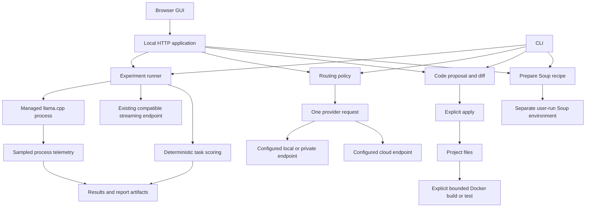

# Architecture

LLM-Optimise separates experiment measurement, model selection, provider requests and project execution. The GUI and CLI call the same Python modules. The core depends on `psutil`; tensor frameworks, model runtimes, Soup and Docker remain separate capabilities.

The arrows identify execution paths, not a claim that every provider, operating system or training backend has been tested live. Consult the repository's validation evidence for the tested combinations.

## Module responsibilities

| Module | Responsibility |
| --- | --- |
| `cli.py`, `__main__.py` | Argument parsing, JSON output, exit statuses and shared entry points |
| `server.py`, `static/` | Local HTTP interface, workspace state, operation jobs and browser controls |
| `config.py` | Strict experiment dataclasses, bounded sweep expansion, relative-path resolution and hashing |
| `backend.py` | Managed llama.cpp lifecycle and external streaming benchmark adapter |
| `hardware.py` | Lightweight hardware detection and sampled process-tree memory guards |
| `quality.py` | Task loading and deterministic exact/numeric/JSON scoring |
| `runner.py` | Trial sequencing, warmup, samples, provenance, resume, eligibility and frontier |
| `report.py` | Standalone HTML and CSV export |
| `planner.py` | Transparent dense-transformer memory estimates |
| `routing.py` | Pure policy filtering/ranking over user-supplied model descriptors |
| `providers.py`, `network.py` | One-shot protocol requests, credential lookup, destination checks and redirect refusal |
| `agent.py` | Catalogue loading, routed requests, bounded chat context and suggestion parsing |
| `workspace.py` | Selected context, code-response validation, path checks, diffs and stale-file protection |
| `containers.py` | Disposable project copies and bounded Docker execution |
| `training.py` | Soup configuration generation and preparation notes |

## Experiment lifecycle

Configuration loads before inference. The loader expands Cartesian sweeps within `max_trials`, resolves paths, rejects unknown keys and loads uniquely identified tasks. The runner hashes its inputs, records the hardware snapshot and chooses a deterministic shuffled execution order.

For a managed candidate, the adapter starts a new loopback server with a temporary authentication key and explicit runtime settings. Ambient `LLAMA_ARG_*` settings are removed from its environment to reduce hidden configuration. The stored command redacts the temporary key. Readiness verifies the managed server before warmup and measured requests.

The monitor samples server-tree RSS and available system RAM, with supported NVIDIA process telemetry. The runner checks cancellation and guard violations, scores complete responses, records request JSONL, evaluates gates and updates results. Completed trials can be reused by a matching managed resume; partial trials are retried as units.

The frontier uses quality, median latency and available process/GPU memory measurements. Missing telemetry does not become an invented zero or an advantage. External endpoint experiments share response measurement and scoring but have no managed server lifecycle, process-memory observation or reliable resume identity.

## Routing and conversation lifecycle

Routing is deterministic and contains no network calls or credential reads. Model descriptors contain endpoint identity, supported capacities/capabilities and optional user-supplied metrics. Hard constraints filter the set, then the chosen objective ranks it. Pinning changes selection but retains hard constraints.

The provider layer reads the selected credential environment variable immediately before a request, validates destination rules and sends one protocol request. Response usage can support configured-price accounting; it does not establish provider billing. Provider errors do not trigger a different endpoint or cloud fallback.

Chat adds bounded lab context and recent result summaries to the user's conversation. Its experiment suggestion is separately checked against known local paths and operation-size limits. A visible user action is required to load or run a suggestion. Chat is not a shell/tool execution loop.

## Code and execution boundaries

Develop sends only selected context plus its request. The response is validated into complete file replacements with original hashes and diffs. Apply verifies those hashes and portable path boundaries before writing. Generation and application do not execute project code.

Docker execution is a separate action. It snapshots a bounded subset of the project and runs a fixed runtime/action command in a resource-limited non-root container. The app container itself does not receive a Docker socket. Generated code gets neither the original project mount nor host Docker control.

## State, concurrency and privacy

The GUI permits one active operation job at a time. Managed chat serving can persist between requests; it must stop before an experiment begins. Completed GUI job records and run artifacts are stored locally, while live job state and pending GUI proposals belong to the current server process.

The application listens on loopback by default and validates Host, Origin and a per-server token for mutations. This is a local application design, not a multi-user authentication service or a supported public deployment. Compose binds the public-facing host port to loopback while allowing internal container ingress.

The catalogue stores key variable names, never key values. Artifact content can still include prompts, responses, model paths, hardware information and project source. Treat those as user data when publishing evidence. The HTTP layer applies a local content-security policy and bounds request sizes; provider response handling also bounds payload size.

## Evidence boundaries

Keep these claims separate when extending or evaluating the application:

1. **Configured:** a model/runtime appears in settings.
2. **Detected:** an executable or device is visible.
3. **Connected:** the target accepts a concrete request.
4. **Measured:** a run produced traceable timing and available resource observations.
5. **Task-qualified:** the selected configuration passed a representative independent evaluation.
6. **Deployed:** the exact intended target and workload were checked separately.

A calculator result or prepared Soup recipe establishes none of the later stages. Passing software tests verifies their covered contracts; it does not establish live accelerator, cloud-provider, training or deployment behaviour.
