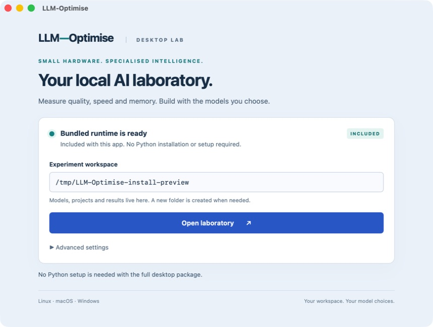

# Install LLM-Optimise

Download a package for your computer from [GitHub Releases](https://github.com/ShaunPrice/LLM-Optimise/releases). The standalone desktop packages include Python, the LLM-Optimise application and its MCP interface. You do not need to install Python, Node.js or Rust to use them.

Model weights, inference engines, GPU drivers, Soup training environments and Docker remain optional separate installations. Opening the laboratory does not download a model or call a paid provider.

## Choose a download

Use the architecture shown in your operating system's system information. On a Mac, **About This Mac → Chip** identifies Apple Silicon; **Processor → Intel** identifies an Intel Mac.

| Computer | Asset label | Package |
|---|---|---|
| Mac with Apple Silicon | `macos-arm64` | `.dmg` |
| Mac with an Intel processor | `macos-x64` | `.dmg` |
| Windows with an Intel or AMD 64-bit processor | `windows-x64` | `-setup.exe` |
| Linux on an Intel or AMD 64-bit processor | `linux-x64` | `.deb` or `.AppImage` |
| Linux on a 64-bit ARM processor | `linux-arm64` | `.deb` or `.AppImage` |

Choose assets actually attached to the release, and read that release's validation notes. Windows ARM, 32-bit systems and macOS universal binaries are not installer targets in this workflow. A Linux ARM build does not establish that a particular Jetson, Raspberry Pi or GPU backend is supported.

The Mac package declares macOS 12 or later; release CI uses macOS 15. Linux x64 packages are built on Ubuntu 22.04 and ARM64 packages on Ubuntu 24.04, so use a compatible distribution at least as recent as that build baseline. AppImage compatibility still depends on the host's core libraries and desktop environment. Windows packages require a compatible x64 Windows system and Microsoft WebView2; the installer includes Microsoft's bootstrapper and runs it to download WebView2 if needed. [Tauri Linux compatibility](https://v2.tauri.app/distribute/appimage/), [WebView2 installation](https://v2.tauri.app/distribute/windows-installer/#webview2-installation-options).

## macOS

1. Download the matching `.dmg` and open it.
2. Drag **LLM-Optimise** to **Applications**.
3. Eject the disk image and open LLM-Optimise from Applications.
4. Keep the bundled runtime selected, choose a writable workspace, and start the laboratory.

Experimental packages are not Developer ID signed or Apple notarized. If macOS blocks an app from an unidentified developer, first verify the download and its published checksum. For a package you trust, Apple's supported per-app exception is **System Settings → Privacy & Security → Open Anyway** after attempting to open it. Availability depends on your Mac's management policy. Follow [Apple's guidance](https://support.apple.com/en-au/102445); do not disable Gatekeeper or remove quarantine attributes broadly.

## Windows

1. Download the `windows-x64` setup executable and run it.
2. Complete the installer for your current user. It creates a Start Menu entry and installs the app with its own runtime.
3. Open **LLM-Optimise** from the Start Menu.
4. Keep the bundled runtime selected, choose a writable workspace, and start the laboratory.

An internet connection may be needed if WebView2 is missing. This dependency is maintained by Microsoft; the application does not bundle a fixed browser engine.

Experimental installers are not Authenticode signed. Windows may show an unknown-publisher or SmartScreen reputation warning. After checking the release source and checksum, use **More info → Run anyway** only if Windows offers that per-file choice and your organisation permits it. Managed policy can block unsigned applications. Do not switch off SmartScreen or antivirus protection. [Microsoft SmartScreen overview](https://learn.microsoft.com/en-us/windows/security/operating-system-security/virus-and-threat-protection/microsoft-defender-smartscreen/).

## Linux

The `.deb` route integrates with a Debian/Ubuntu desktop and lets the package manager install system dependencies. In the directory containing your downloaded package, run the command below with its exact filename:

```bash
sudo apt install ./LLM-Optimise-0.1.1-linux-x64.deb
```

Use the `linux-arm64` asset on ARM64. Launch **LLM-Optimise** from the desktop application menu, keep the bundled runtime selected, and choose a writable workspace.

For AppImage, save the file in a permanent directory, mark that exact file executable, then open it:

```bash
chmod +x LLM-Optimise-0.1.1-linux-x64.AppImage
./LLM-Optimise-0.1.1-linux-x64.AppImage
```

If your distribution has no compatible FUSE support, extract the AppImage into its own directory and run its launcher:

```bash
./LLM-Optimise-0.1.1-linux-x64.AppImage --appimage-extract
./squashfs-root/AppRun
```

Keep the extracted directory together. Linux needs a graphical desktop session; on a headless server, use the [CLI or browser interface](getting-started.md). A `GLIBC_* not found` message means the operating system is older than the package's build baseline. Use a compatible release or build from source on your target system.

## First launch and your data



The bundled runtime is the simplest starting point. Advanced users can select an existing trusted Python environment that already contains LLM-Optimise. That choice changes the service interpreter; it does not install or upgrade packages in that environment.

Choose a workspace outside the installation directory, such as a dedicated folder in Documents. The laboratory writes experiment artifacts under `runs/`, code projects under `projects/`, and local model configuration under `.llm-optimise/`. Model files can live in a separate directory. Keep this workspace when updating or uninstalling the application.

Start with **Hardware** and the [getting-started tutorial](getting-started.md). Configure an installed local endpoint or your own provider catalogue before asking the app to generate answers. Provider credentials remain environment-variable references. GUI applications may not inherit variables from a shell startup file; see [troubleshooting](troubleshooting.md) for environment and runtime paths.

Use the tray's **Quit and stop owned models** action to exit completely. Closing the laboratory window can leave the service running in the tray. Stop active work before updating or uninstalling.

## CLI and MCP from the installed app

The runtime contains the CLI and optional MCP dependencies. It is private to this installation and does not replace your system Python or change the system PATH. The bundled `runtime/manifest.json` identifies its interpreter and included packages; use the supplied runtime launchers or that interpreter to run the application.

For example, after installing the Mac app in Applications:

```bash
"/Applications/LLM-Optimise.app/Contents/Resources/runtime/llm-optimise" --help
"/Applications/LLM-Optimise.app/Contents/Resources/runtime/llm-optimise-mcp" --help
```

On Windows, open PowerShell in the installation folder you selected in the wizard:

```powershell
.\runtime\llm-optimise.cmd --help
.\runtime\llm-optimise-mcp.cmd --help
```

For an MCP client's `command` setting, use the bundled Python executable listed in `runtime/manifest.json` with arguments `-I -m llm_optimise.mcp_server`. On Windows this is `runtime\python\python.exe` inside the installation folder; on macOS and Linux it is `runtime/python/bin/python3` inside the application resources.

MCP connects to the running desktop service's loopback URL and the same workspace. Copy **Local service URL** from the launcher's Advanced settings into the client's `--app-url` argument; a desktop session can use a dynamically allocated port. It shares the GUI's jobs and cancellation state. See [MCP setup and client examples](mcp.md) for stdio, authenticated HTTP and remote-client requirements. Installing the application does not automatically configure ChatGPT or Claude.

## Verify a download

Compare the exact file's SHA-256 hash with the checksum provided with that release. A matching hash checks file integrity; it does not replace code signing or establish publisher identity.

```bash
# macOS
shasum -a 256 LLM-Optimise-0.1.1-macos-arm64.dmg

# Linux
sha256sum LLM-Optimise-0.1.1-linux-x64.AppImage
```

```powershell
# Windows PowerShell
Get-FileHash .\LLM-Optimise-0.1.1-windows-x64-setup.exe -Algorithm SHA256
```

## Update or uninstall

Install a newer matching package after stopping the app and owned models. Keep your existing workspace selection; the workspace holds your work independently of the application. Automatic updating is not configured.

- **macOS:** replace the app in Applications to update; move it to Trash to uninstall.
- **Windows:** run the newer installer to update; use **Settings → Apps → Installed apps → LLM-Optimise → Uninstall** to remove it.
- **Debian/Ubuntu:** install the newer `.deb`; use `sudo apt remove llm-optimise` to uninstall.
- **AppImage:** replace or remove the AppImage, or its extracted directory.

Application preferences and your workspace may remain after uninstall. Removing a workspace is a separate, deliberate data-deletion action. If installation fails, include the OS, architecture, release filename and relevant log with an [issue](https://github.com/ShaunPrice/LLM-Optimise/issues); remove credentials and private prompts first.

## What installer validation proves

The [installer workflow](../.github/workflows/installers.yml) builds each target natively, checks package layout and bundled runtime relocation, launches a real webview with fresh settings, verifies the local HTML/state API, and checks service shutdown. Windows also exercises installation and removal; Linux exercises a `.deb` installation and an extracted AppImage. Accepted artifacts include platform-specific validation reports.

These checks establish the tested package path on its CI host. They do not establish code-signing reputation, every Linux distribution, every historical OS release, every GPU driver or model quality. See the particular release's reports and the broader [validation record](validation.md).
