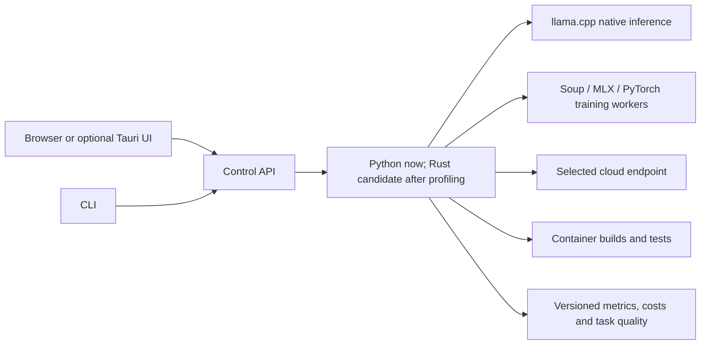

# Performance roadmap: measure, then replace

Proposed additions, 9 September 2026. This is a prioritised engineering roadmap, not a list of completed features or promised speedups.

## Where Rust can help

Yes: a Rust supervisor could replace the Python process manager, HTTP/streaming proxy, resource-admission logic and high-volume telemetry aggregation. It could provide one packaged binary with predictable allocation and structured concurrency. A [PyO3](https://pyo3.rs/main/) extension is a smaller migration option for an identified Python hot loop; a [Tauri](https://v2.tauri.app/start/) shell is an option for native desktop packaging using the operating system's webview. Neither automatically makes LLM matrix operations faster.

The current app already delegates those operations to native [llama.cpp](https://github.com/ggml-org/llama.cpp). Soup's Python orchestration similarly calls MLX or PyTorch tensor kernels. Rewriting their orchestration in Rust would not remove weight bandwidth, KV-cache growth or GPU compute costs.

Our existing Mac observation is ~23 MiB RSS for the GUI server, with the browser and model excluded. Its short CPU sample was 0.5%. That is not evidence of a Python bottleneck. The first Rust candidate should be chosen from a profile at realistic concurrency, not from language reputation.

For example, if orchestration accounts for 5% of request time, even eliminating all of it caps the speedup at 1/0.95 ≈ 1.053×. This is an illustration, not a measured decomposition of this app.

## Ranked experiments and features

| Priority | Addition | Expected benefit to test | Trade-off / success criterion |
|---|---|---|---|
| 1 | Deterministic task components | Remove per-request LLM cost for rules, parsing, validation or numeric transformations | Use the LLM to build/review a tested implementation, then run Python/Rust/native code where the task has a precise specification; measure correctness and runtime. |
| 1 | Domain dataset workbench and regression gates | Select smaller models that actually meet the specialised task | Separate train/tuning/held-out sets; retain failures, schema validity and task-specific error costs. No quality claims from smoke data. |
| 1 | Memory-aware model manager | Avoid duplicate residency and out-of-memory failures | Observe current memory, reserve headroom, admit bounded concurrency, unload idle models; measure cold-start and reload cost. |
| 1 | Hardware capacity explorer | Find the largest useful model/context/batch inside a chosen RAM/VRAM budget | Increase one dimension at a time in isolated workers, preserve system headroom, record failures and recover automatically. A feasible configuration must also pass quality and latency gates. |
| 1 | Adapter lifecycle in the GUI | Train, save, reload, evaluate and compare Soup adapters without manual wiring | Isolated pinned environments, bounded jobs, complete adapter provenance; resident/streaming correctness controls. Live training validation is a prerequisite. |
| 1 | Automatic routing calibration | Choose the cheapest/faster model that meets task quality | Store measured latency/quality/cost by task class, model revision, prompt size and hardware; unknowns remain unknown. Explicitly authorised escalation only. |
| 2 | KV-cache and context optimisation presets | Reduce RAM/VRAM as context or concurrency grows | Sweep context, KV precision and Flash Attention with held-out quality checks; report actual allocation and failures. Runtime controls already exist; presets and live coverage need expansion. |
| 2 | Exact prefix/result caching | Reuse repeated agent instructions and deterministic task requests | Cache identity includes model/adapter revision, decoding options, tool/schema and prompt. Measure hit rate, TTFT and memory; expire caches when inputs change. |
| 2 | Task-specific context selection | Reduce prompt tokens and prefill work | Compare retrieval and structured extraction against the full context; measure omitted-fact errors and total cost including preprocessing. |
| 2 | Speculative decoding workbench | Improve decoding when draft verification pays off | Measure accepted draft tokens, verification time and extra memory. Draft-model and n-gram approaches have different resource costs; no universal speedup. |
| 2 | Accelerator backend comparison | Find the best CPU/CUDA/Metal/Vulkan/ROCm path for each device | Check runtime/driver support, compare equal models and quality, and distinguish system RAM from per-device allocations. |
| 2 | Multi-fidelity experiment search | Reach useful settings in fewer trials | Prune only after minimum quality evidence, promote promising candidates to more repetitions, retain uncertainty and avoid tuning to the test set. |
| 2 | Build/test feedback to the coding agent | Repair failed generated solutions automatically within a budget | Bounded iterations, user-reviewed file changes, container isolation, regression tests and total cost/time accounting. |
| 3 | Distillation and specialist task routing | Replace expensive general models with smaller task models | Obtain suitable licensed/authorised training data; evaluate on unseen examples and allow explicit abstention/escalation. |
| 3 | Rust control daemon or targeted PyO3 extension | Lower orchestration latency, idle RSS and packaging overhead | Profile first; compare equal-feature builds under the same workload. Preserve cancellation, origin/credential checks, error handling and cross-platform tests. |
| 3 | Tauri desktop packaging | Native launch, app icon, tray controls and OS integration | Measure total memory including the webview; do not claim browser memory disappears. Keep CLI independent. |

llama.cpp's [server documentation](https://github.com/ggml-org/llama.cpp/blob/master/tools/server/README.md) describes cache, context, batching and output controls. Its [speculative decoding documentation](https://github.com/ggml-org/llama.cpp/blob/master/docs/speculative.md) explains draft-model and n-gram options, as well as model-specific techniques. Availability must be checked against the installed runtime, not inferred from the latest documentation.

## A sensible language boundary

Keep Python where its ML ecosystem saves integration work. Keep the existing native inference engines. Introduce Rust at a measured control or data-processing bottleneck with a stable interface, rather than duplicating model implementations.

## Acceptance criteria for a Rust experiment

Capture request p50/p95/p99, first-token latency, CPU time, RSS, allocation rate, cancellation latency and dropped/queued requests at realistic concurrency. Include startup and model reload time. Benchmark idle operation, a cheap local endpoint and a representative loaded model separately. Assert output equivalence, lifecycle cleanup and resource-limit behaviour. A faster microbenchmark alone is not an application win.

Suggested first milestone: implement a memory-aware lifecycle manager with task-specific routing calibration, then profile its supervisor. Use that evidence to decide whether Rust replaces the service or only one hot path. Performance targets should be set from this baseline; no speedup multiple is promised here.
