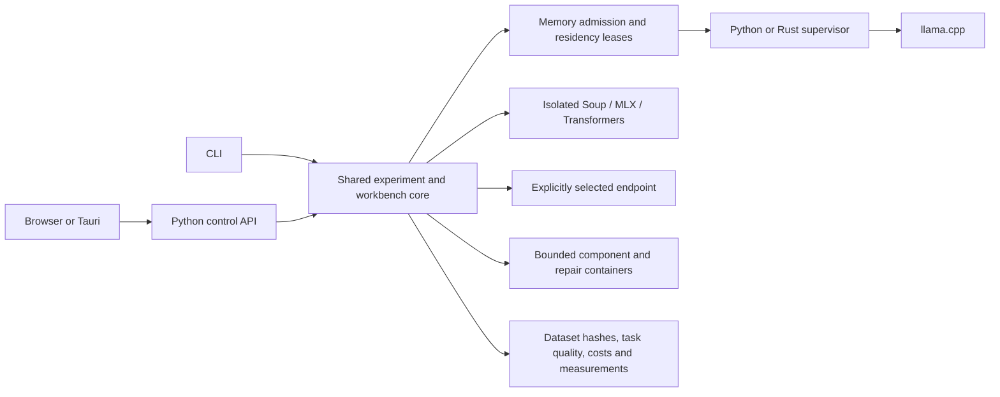

# Implemented performance roadmap

All 16 proposed additions now have executable implementations. The table distinguishes software behaviour from live hardware evidence. Read the [workbench guide](workbench.md) for operation names, settings and examples.

| Addition | Implementation | Validation and limits |
|---|---|---|
| Deterministic components | `development.py`: isolated Python/Rust JSON contracts and host scoring | Real Docker compilation, passing/failing cases and timeout retention; benchmark includes process/container overhead. |
| Domain datasets and regression | `datasets.py`: deduplication, group-disjoint splits, schema and error-cost gates | Automated leakage, schema, missing-output and regression fixtures; domain quality depends on user data. |
| Memory-aware lifecycle | `lifecycle.py`, `managed.py`: admission, leases, concurrency, idle unload/reload | Process/lifecycle tests and real Mac Rust-managed inference/reload. |
| Hardware capacity explorer | `exploration.py`: bounded staircase, failure classification and recovery control | Actual fixture-process failure/recovery tests; bounded Mac comparisons, not a device ceiling. |
| Adapter lifecycle GUI | `training_jobs.py`: real train/register/reload/evaluate/compare | New Mac MLX API training and fresh adapter application/evaluation; prior Omen resident/streamed CUDA proof. |
| Routing calibration | `intelligence.py`: scoped observations and conservative quality confidence | Budget, partial failure, retention and schema fixtures; empirical quality requires matching scored tasks. |
| KV/context presets | `exploration.py`: context/precision sweeps | Live Mac f16/q8_0 comparisons; other combinations remain runtime/model dependent. |
| Exact prefix/result caching | `providers.py`, `intelligence.py`: opt-in runtime prefix reuse and versioned bounded exact cache | Real Mac exact hit; invalidation, cost and constraint tests; prefix reuse depends on runtime evidence. |
| Task-specific context | `context.py`, code GUI/CLI: ranked source spans and required facts | Omitted-fact, adjacency and irrelevant-context tests; lexical retrieval can omit relevant facts. |
| Speculative decoding | `exploration.py`, `backend.py`: baseline/draft comparisons and observed counters | Protocol/capability fixtures; real draft-model speedup has not been established. |
| Accelerator comparisons | `exploration.py`: explicit CPU/Metal/CUDA/Vulkan/ROCm capability checks | CPU and Metal run on Mac; other paths require compatible hardware/runtime validation. |
| Multi-fidelity search | `exploration.py`: common nested subsets, promotion and final held-out check | Real fixture workers validate selection, pruning and held-out separation. |
| Build/test feedback | `development.py`: staged bounded repairs and immutable acceptance artifacts | Real Python and Rust failure-to-pass repair; Node JUnit; spoofed counts rejected. |
| Distillation/specialists | `distillation.py`, `intelligence.py`: training-only teacher curation, task restrictions, contracts and explicit escalation | Data/budget/contract fixtures and CLI integration; student quality requires unseen evaluation. |
| Rust supervisor | `native/`, `native_runtime.py`: process ownership, RSS, deadlines and cancellation | Built/profiled on Mac; actual inference integration passed. Detailed platform evidence in native validation. |
| Tauri desktop | `desktop/`: native launcher/window/tray and owned Python sidecar | Mac app built and native webview/service/cleanup checked; target-platform CI checks compilation. Signing and installer acceptance remain release work. |

## Language boundaries

The Rust supervisor is the chosen native replacement. Python remains the API, routing and ML integration layer; llama.cpp, MLX and PyTorch provide native model kernels. A separate PyO3 implementation would duplicate the chosen supervisor approach without current evidence that another Python hot loop merits replacement.

## What the measurements mean

The Rust overhead comparison uses equal idle, cancellation, resource-limit and process-exit workloads. It reports supervisor memory separately from worker memory. On the tested Mac, Rust used less idle RSS and started faster; cancellation was similar in the three-repeat sample. This does not establish faster LLM decoding or lower GPU allocation.

The new Mac explorer compared six smoke tasks across CPU/Metal and KV configurations. It establishes working controls and recorded trade-offs, not domain accuracy, universal backend superiority or hardware limits. Run representative task datasets, larger repetitions and an independent held-out gate before choosing a deployment configuration.

[Actual evidence](validation.md) · [Rust profile](../native/README.md) · [Desktop build](../desktop/README.md)
