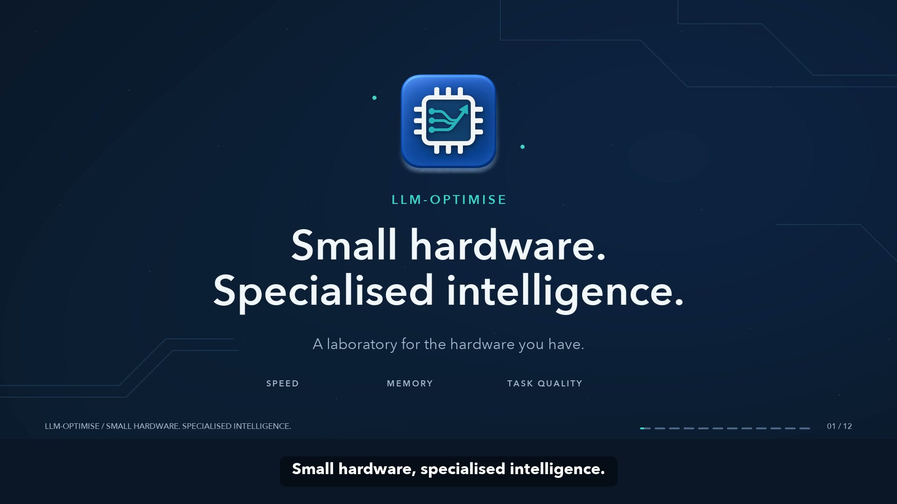

# LLM-Optimise product film

[](https://github.com/ShaunPrice/LLM-Optimise/releases/download/v0.1.0-experimental/LLM-Optimise-product-film.mp4)

**Small hardware. Specialised intelligence.** A 2 minute 6 second product walkthrough with real application screenshots, an ElevenLabs female narration, original generated instrumental music, animated architecture diagrams, intro/outro and captions.

[Download the 1080p film and captions](https://github.com/ShaunPrice/LLM-Optimise/releases/tag/v0.1.0-experimental) · [Narration transcript](narration.txt) · [Storyboard](narration-scenes.json) · [Encoding and audio measurements](output/quality-report.json)

## What the film shows

Twelve scenes explain the constrained-hardware laboratory, task and quality configuration, measured comparisons, bounded searches, the Python/Rust architecture, local/cloud routing, model-assisted development with Docker tests, Soup adapters, chat/MCP access, validation scope and the open-source project.

Screenshots come from the running application. The capacity example tested two CPU configurations on an Apple M4: both passed its six-task smoke quality gate. The selected candidate is the largest passing context in that search, not the lowest-latency candidate. The development scene shows a real OpenRouter-generated temperature normaliser change that passed three tests inside a 128 MiB Docker container. The chat reply also came from the configured OpenRouter model. These small examples demonstrate the workflows; they do not establish task generalisation or a hardware ceiling. [Recorded demonstration evidence](../../validation/marketing-workflows.json)

The Soup screenshot is explicitly labelled **recipe preparation**. Recorded training/reload evidence is documented separately in [validation](../../docs/validation.md). The architecture separates optional Rust process supervision from model inference kernels, and distinguishes the MCP resource server from a separately deployed HTTPS/OAuth connector. No live hosted ChatGPT or Claude connection is claimed.

## Voice and music provenance

- **Narration:** ElevenLabs, library voice **Ellen — Serious, Direct and Confident**, described by the service as a calm female voice with an international accent. Generated with **Eleven v3** through the existing signed-in account on 9 September 2026. The selected first generation is 116.036 seconds; 1,604 existing credits were consumed. No custom voice clone was created.
- **Score:** Original instrumental generated on the Omen through ComfyUI using **ACE-Step v1 3.5B**, seed `19670909`, approximately 110 seconds. Direction: restrained electronic ambient technology underscore, warm synth chords, muted arpeggios and subtle percussion, without vocals. A six-second crossfade extends the score smoothly; speech ducks the music, with opening and closing fades.
- **Timing:** Local word alignment produced 238 timestamped words. Scene openings match actual phrase anchors, with cuts between words. The finished edit has 41 synchronised caption cues. Product spelling and obvious transcription inflections were corrected against the approved narration text.
- **Identity:** Existing project icon, navy/cobalt/teal palette and custom animated diagrams. Real screenshots are framed and cropped. Narrow masks labelled **Local path omitted** cover reviewed machine paths; [visual design notes](visual-design.md) identify them precisely.

Project source remains MIT licensed. Third-party services, voice assets, model runtimes and fonts retain their own terms; this project does not redistribute their models or font files.

## Deliverables and quality checks

The master is H.264, 1920 × 1080, 30 fps, with stereo 48 kHz AAC audio and web-friendly fast-start metadata. Captions are burned into a reserved lower band and also supplied as [SRT](output/captions.srt). The approximately 10 MB MP4 is a release asset rather than a binary in source history.

The encoded deliverable was checked for dimensions, codecs, frame rate, duration, loudness and true peak. The 12-scene encoded contact sheet was visually reviewed for text, masks, evidence and caption placement. Measured loudness is about **−14.5 LUFS**, with true peak below **−1 dBTP**. The exact file hash and measurements are in [quality-report.json](output/quality-report.json).

## Rebuilding the edit

The scripts require Python 3.10+, Pillow, NumPy, FFmpeg and FFprobe. FFmpeg must include `libx264`, AAC, `acrossfade`, `sidechaincompress` and `loudnorm`. The compositor uses installed fonts, with fallbacks described in its design notes; this recorded master was rendered on macOS with Avenir Next.

Original production audio and unredacted screenshots are retained in the local production workspace and excluded from Git. To create your own edit, supply the screenshot names listed in [visual-design.md](visual-design.md), `audio/narration-full.mp3`, `audio/music-original.flac`, and actual word timestamps in `audio/alignment.json`. Re-record or revise the narration/storyboard for your application version. Do not substitute estimated word timings for actual speech alignment.

```bash
python -m pip install Pillow numpy
python marketing/video/scripts/prepare.py
python marketing/video/scripts/visuals.py --proof
python marketing/video/scripts/render.py --proof
python marketing/video/scripts/render.py
python marketing/video/scripts/verify.py
```

Review every proof when replacing screenshots: crops and labelled masks depend on their source positions. Production rendering refuses missing screenshots. `render.py --audio-only` remixes an already rendered picture. `verify.py` writes encoded review frames and the machine-readable quality report. Rebuilds can differ in font rendering, codec bytes and provider-generated media; the published SHA-256 identifies this exact delivered master.
